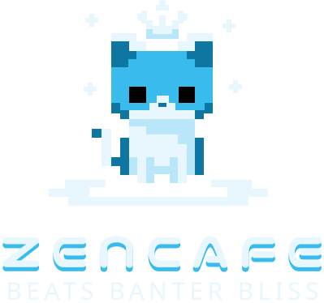
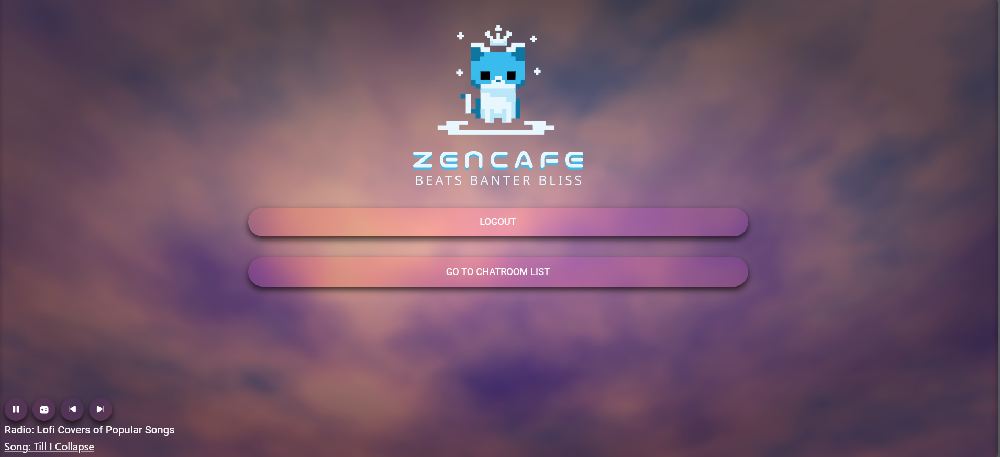
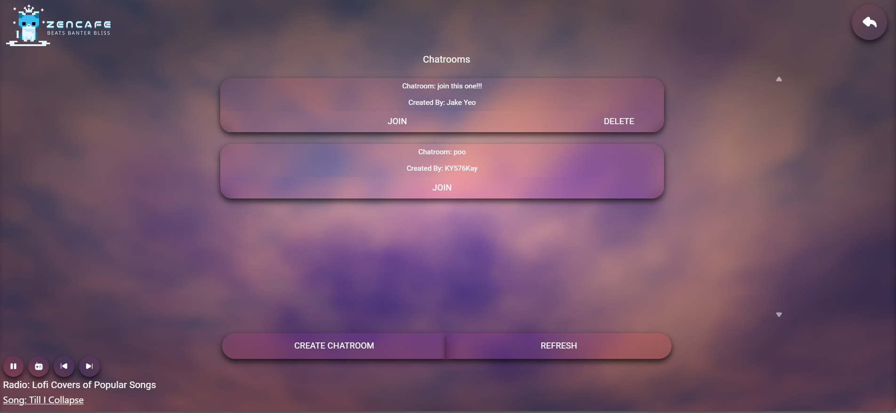
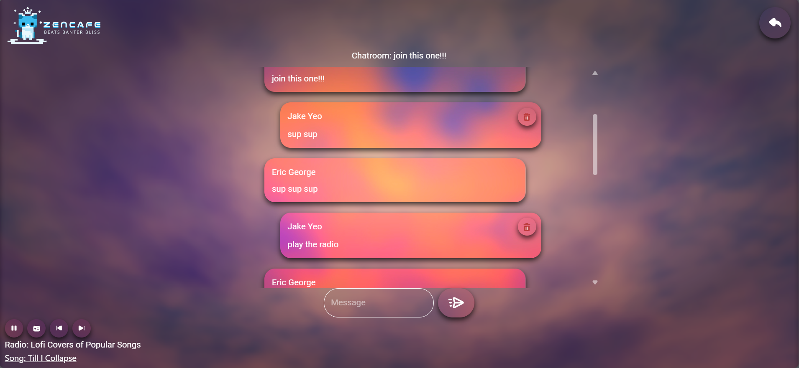

<!-- Improved compatibility of back to top link: See: https://github.com/othneildrew/Best-README-Template/pull/73 -->

<!--
*** Thanks for checking out the Best-README-Template. If you have a suggestion
*** that would make this better, please fork the repo and create a pull request
*** or simply open an issue with the tag "enhancement".
*** Don't forget to give the project a star!
*** Thanks again! Now go create something AMAZING! :D
-->

<!-- PROJECT SHIELDS -->
<!--
*** I'm using markdown "reference style" links for readability.
*** Reference links are enclosed in brackets [ ] instead of parentheses ( ).
*** See the bottom of this document for the declaration of the reference variables
*** for contributors-url, forks-url, etc. This is an optional, concise syntax you may use.
*** https://www.markdownguide.org/basic-syntax/#reference-style-links
-->
[![MIT License][license-shield]][license-url]
[![LinkedIn][linkedin-shield]][linkedin-url]

<!-- PROJECT LOGO -->
 

  

  

Zen-Cafe is a minamalistic web messaging app that provides calm music of many varieties along with aesthetic backgrounds to provide a calm chill environment for users.
     
     
    <a href="https://zen-cafe.vercel.app/">View Website</a>
    ·
    <a href="https://github.com/Jake-Yeo/zen-cafe/issues">Report Bug</a>
  

<!-- ABOUT THE PROJECT -->
## About The Project

(<a href="#readme-top">back to top</a>)

## User Stories
As a user I want to be able to:
* Create an account and login
* Send messages
* Listen to music via the web app
* Create a chatroom
* Delete chatrooms I create
* Send messages
* Delete messages I send

(<a href="#readme-top">back to top</a>)

## Frontend Technologies
For the frontend, I utilized React to build all the UI components.

## Backend Technologies
For the backend, I utilized Node.js to handle all the backend logic along with Express.js for managing the api routes. For the database I utilized MongoDB along with its changeStreams function to help me easily stream messages sent to the backend to the frontend for display. In order to do this I decided to utilize SSE event which would be sent to the frontend from the backend everytime a message was added to the MongoDB. As for the login and signout functionality, I use Firebase Auth for user convenience, I however implemented my own authentication and authorization logic. After copying user data from Firebase Auth to MongoDB, I issued a 12-hour JWT token to every user that either logs in or creates an account. This token would then be sent to the backend everytime a user accessed the database. Without the token, they would not be able to access the API. Further more, the token also allowed me to ensure that users could only delete chatrooms and messages that they themselves created. I hosted the frontend with Vercel and the backend with Railway.

### Built With
[Typescript]: https://img.shields.io/badge/TypeScript-007ACC?style=for-the-badge&logo=typescript&logoColor=white
[Typescript-url]: https://www.typescriptlang.org/
 [![Typescript][Typescript]][Typescript-url]

[React.js]: https://img.shields.io/badge/React-20232A?style=for-the-badge&logo=react&logoColor=61DAFB
[React-url]: https://reactjs.org/
 [![React][React.js]][React-url]

 [Node.js]: https://img.shields.io/badge/Node%20js-339933?style=for-the-badge&logo=nodedotjs&logoColor=white
[Node-url]: https://nodejs.org/en
 [![Node][Node.js]][Node-url]

  [Express.js]: https://img.shields.io/badge/Express%20js-000000?style=for-the-badge&logo=express&logoColor=white
[Express-url]: https://expressjs.com/
 [![Express][Express.js]][Express-url]

   [Firebase]: https://img.shields.io/badge/firebase-ffca28?style=for-the-badge&logo=firebase&logoColor=black
[Firebase-url]: https://firebase.google.com/
 [![Firebase][Firebase]][Firebase-url]

[MongoDB]: https://img.shields.io/badge/MongoDB-4EA94B?style=for-the-badge&logo=mongodb&logoColor=white
[MongoDB-url]: https://www.mongodb.com/
 [![MongoDB][MongoDB]][MongoDB-url]

 [Railway]: https://img.shields.io/badge/Railway-131415?style=for-the-badge&logo=railway&logoColor=white
[Railway-url]: https://railway.app/
 [![Railway][Railway]][Railway-url]

[Vercel]: https://img.shields.io/badge/Vercel-000000?style=for-the-badge&logo=vercel&logoColor=white
[Vercel-url]: https://vercel.com/
 [![Vercel][Vercel]][Vercel-url]

[JWT]: https://img.shields.io/badge/JWT-000000?style=for-the-badge&logo=JSON%20web%20tokens&logoColor=white
[JWT-url]: https://jwt.io/
 [![JWT][JWT]][JWT-url]

 [JSON]: https://img.shields.io/badge/json-5E5C5C?style=for-the-badge&logo=json&logoColor=white
[JSON-url]: https://www.json.org/json-en.html
 [![JSON][JSON]][JSON-url]

<!-- LICENSE -->
## License

Distributed under the MIT License. See `LICENSE.txt` for more information.

(<a href="#readme-top">back to top</a>)

<!-- CONTACT -->
## Contact

Jake Yeo - jakeyeozh@gmail.com

Project Link: [https://github.com/Jake-Yeo/zen-cafe](https://github.com/your_username/repo_name)

LinkedIn: [https://www.linkedin.com/in/jake-yeo]()

(<a href="#readme-top">back to top</a>)

<!-- ACKNOWLEDGMENTS -->

<!--
## Acknowledgments

Use this space to list resources you find helpful and would like to give credit to. I've included a few of my favorites to kick things off!

* [Choose an Open Source License](https://choosealicense.com)
* [GitHub Emoji Cheat Sheet](https://www.webpagefx.com/tools/emoji-cheat-sheet)
* [Malven's Flexbox Cheatsheet](https://flexbox.malven.co/)
* [Malven's Grid Cheatsheet](https://grid.malven.co/)
* [Img Shields](https://shields.io)
* [GitHub Pages](https://pages.github.com)
* [Font Awesome](https://fontawesome.com)
* [React Icons](https://react-icons.github.io/react-icons/search)

(<a href="#readme-top">back to top</a>)

>

<!-- MARKDOWN LINKS & IMAGES -->
<!-- https://www.markdownguide.org/basic-syntax/#reference-style-links -->
[contributors-shield]: https://img.shields.io/github/contributors/othneildrew/Best-README-Template.svg?style=for-the-badge
[contributors-url]: https://github.com/othneildrew/Best-README-Template/graphs/contributors
[forks-shield]: https://img.shields.io/github/forks/othneildrew/Best-README-Template.svg?style=for-the-badge
[forks-url]: https://github.com/othneildrew/Best-README-Template/network/members
[stars-shield]: https://img.shields.io/github/stars/othneildrew/Best-README-Template.svg?style=for-the-badge
[stars-url]: https://github.com/othneildrew/Best-README-Template/stargazers
[issues-shield]: https://img.shields.io/github/issues/othneildrew/Best-README-Template.svg?style=for-the-badge
[issues-url]: https://github.com/othneildrew/Best-README-Template/issues
[license-shield]: https://img.shields.io/github/license/othneildrew/Best-README-Template.svg?style=for-the-badge
[license-url]: https://github.com/Jake-Yeo/zen-cafe/blob/master/LICENSE
[linkedin-shield]: https://img.shields.io/badge/-LinkedIn-black.svg?style=for-the-badge&logo=linkedin&colorB=555
[linkedin-url]: https://www.linkedin.com/in/jake-yeo
[product-screenshot]: public/svgFiles/screenshot.png
[Next.js]: https://img.shields.io/badge/next.js-000000?style=for-the-badge&logo=nextdotjs&logoColor=white
[Next-url]: https://nextjs.org/
[Vue.js]: https://img.shields.io/badge/Vue.js-35495E?style=for-the-badge&logo=vuedotjs&logoColor=4FC08D
[Vue-url]: https://vuejs.org/
[Angular.io]: https://img.shields.io/badge/Angular-DD0031?style=for-the-badge&logo=angular&logoColor=white
[Angular-url]: https://angular.io/
[Svelte.dev]: https://img.shields.io/badge/Svelte-4A4A55?style=for-the-badge&logo=svelte&logoColor=FF3E00
[Svelte-url]: https://svelte.dev/